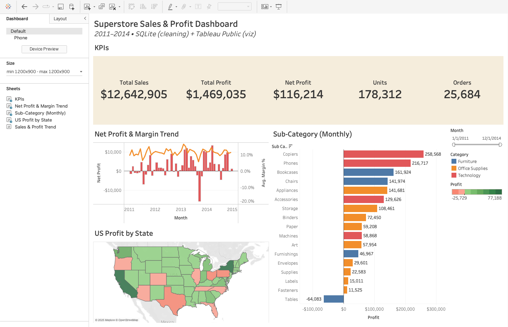

# Superstore Sales & Profit Dashboard (SQLite + Tableau)

[**Live Dashboard**](<https://public.tableau.com/views/SuperstoreSalesProfitDashboardSQLiteTableau/Dashboard1?:language=en-US&:sid=&:redirect=auth&publish=yes&showOnboarding=true&:display_count=n&:origin=viz_share_link>)



Portfolio project that demonstrates a compact **ETL → analytics → visualization** workflow:
- **Data:** Kaggle “Superstore Sales” (Laiba Anwer variant)
- **ETL:** Python normalizer → SQLite staging & typed tables → SQL exports
- **Viz:** Tableau Public packaged workbook (`.twbx`) with interactive Month filter

---

## Highlights
- **Rows:** 51,290  
- **Date span:** 2011-01-01 → 2014-12-31  
- **Dashboard contents:**
  - KPI row: **Total Sales, Total Profit, Net Profit, Units, Orders**
  - **Net Profit & Margin %** (monthly, dual-axis bar+line)
  - **US Profit by State** (monthly filled map)
  - **Profit by Sub-Category (Monthly)** (Top-N ready)
  - Global **Month** range filter applied across views

---

## Repo Structure

```text
superstore-sales-sqlite-tableau/
|-- data/
|   |-- SuperStoreOrders_clean.csv
|   `-- SuperStoreOrders.csv
|-- scripts/
|   `-- normalize_superstore.py
|-- sql/
|   |-- 01_create_tables.sql
|   |-- 02_load_data.sql
|   |-- 03_data_cleaning.sql
|   |-- 04_analysis_queries.sql
|   |-- 05_views_and_indexes.sql
|   `-- 06_extra_exports.sql
|-- tableau/
|   |-- dashboard.twbx
|   `-- preview.png
|-- .gitignore
|-- LICENSE
`-- README.md
```

## How to Reproduce Locally

**Requirements:** macOS/Linux/Windows, `python3`, `sqlite3`.

    # 1) (Optional) Normalize the raw CSV (makes headers, dates, and numbers deterministic)
    python3 scripts/normalize_superstore.py

    # 2) Build SQLite DB and load/clean data
    sqlite3 superstore.db < sql/01_create_tables.sql
    sqlite3 superstore.db < sql/02_load_data.sql
    sqlite3 superstore.db < sql/03_data_cleaning.sql

    # 3) Generate exports used by Tableau
    mkdir -p exports
    sqlite3 superstore.db < sql/04_analysis_queries.sql

Open **tableau/dashboard.twbx** (packaged), _or_ connect Tableau to the CSVs in `exports/`.

---

## ETL Notes

- **Normalizer (`scripts/normalize_superstore.py`)**
  - Auto-detects delimiter/quoting
  - Standardizes headers to a canonical 21-column schema
  - Converts dates to `YYYY-MM-DD`
  - Strips currency symbols/commas; handles parentheses negatives

- **SQLite pipeline**
  - `01_create_tables.sql` – staging (`superstore_raw`) + typed (`superstore`)
  - `02_load_data.sql` – imports the cleaned CSV into staging
  - `03_data_cleaning.sql` – casts/converts into the typed table
  - `04_analysis_queries.sql` – monthly/category/region/state/product/customer exports
  - `05_views_and_indexes.sql` – reusable view + helpful indexes
  - `06_extra_exports.sql` – additional analyses (e.g., state/monthly)

---

## Data Source & License

- Source dataset: **Kaggle – Superstore Sales (by Laiba Anwer)**. Review the dataset’s license/terms on Kaggle before redistribution.
- Code in this repo is under **MIT** (see `LICENSE`).
- If dataset terms restrict redistribution of the **raw** CSV, keep only `data/SuperStoreOrders_clean.csv` in git and exclude `data/SuperStoreOrders.csv` via `.gitignore`.

---

## Tech Stack

- **Python 3** – normalization
- **SQLite 3.51** – ETL & exports
- **Tableau Public** – interactive dashboard (`.twbx`)

---

## Contact

Questions or suggestions? Open an issue on this repo.
